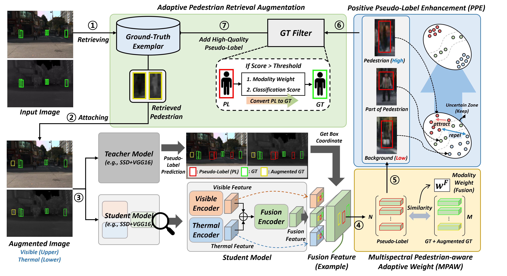

# Multispectral Pedestrian Detection with Sparsely Annotated Label

This repository is the pytorch implementation of our paper, SAMPD.

Accepted at [AAAI 2025](https://aaai.org/conference/aaai/aaai-25/): 

[[Paper](https://ojs.aaai.org/index.php/AAAI/article/view/32472)] [[arXiv](https://arxiv.org/abs/2501.02640)]

<a href="https://github.com/cksdlakstp12"><strong>Chan Lee*</strong></a>
·
<a href="https://github.com/0v0V"><strong>Seungho Shin*</strong></a>
·
<a href="https://scholar.google.com/citations?user=Sz6rfOMAAAAJ&hl=en"><strong>Gyeong-Moon Park</strong></a>📧
·
<a href="https://scholar.google.co.kr/citations?user=JMZ80R8AAAAJ&hl=en"><strong>Jung Uk Kim</strong></a>📧

(* and 📧 indicate equal contribution and corresponding authors, respectively)

<b>Kyung Hee University</b>

<a></a>

_________________ 

## Abstract

Although existing Sparsely Annotated Object Detection (SAOD) approaches have made progress in handling sparsely annotated environments in multispectral domain, where only some pedestrians are annotated, they still have the following limitations: (_i_) they lack considerations for improving the quality of pseudo-labels for missing annotations, and (_ii_) they rely on fixed ground truth annotations, which leads to learning only a limited range of pedestrian visual appearances in the multispectral domain. To address these issues, we propose a novel framework called Sparsely Annotated Multispectral Pedestrian Detection (SAMPD). For limitation (_i_), we introduce Multispectral Pedestrian-aware Adaptive Weight (MPAW) and Positive Pseudo-label Enhancement (PPE) module. Utilizing multispectral knowledge, these modules ensure the generation of high-quality pseudo-labels and enable effective learning by increasing weights for high-quality pseudo-labels based on modality characteristics. To address limitation (_ii_), we propose an Adaptive Pedestrian Retrieval Augmentation (APRA) module, which adaptively incorporates pedestrian patches from ground-truth and dynamically integrates high-quality pseudo-labels with the ground-truth, facilitating a more diverse learning pool of pedestrians. Extensive experimental results demonstrate that our SAMPD significantly enhances performance in sparsely annotated environments within the multispectral domain.
<div align=center>  </div>

## Environment

### Using CONDA

To make it easy to set up your environment, we release an exported file of the `conda environment` we used. To configure the environment using this file, you can use the command below.

```bash
conda env create -f SAMPD_env.yaml
conda activate SAMPD_env
```

### Using pip

If you want to install via pip directly, you can use the commands below. We used `python 3.8` version, please use the command below to install the CUDA version of pytorch.

```bash
pip install -r requirements.txt
pip install torch==1.12.1+cu116 torchvision==0.13.1+cu116 torchaudio==0.12.1 --index-url https://download.pytorch.org/whl/cu116
```

## Weights

We release our best-performing and pre-trained baseline model weights. You can download these weights at [Google Drive](https://drive.google.com/drive/folders/1FdNYGxP-tMKyZjhsFKKL9SNQ2520oVuB?usp=sharing) and place them under `weights` directory. If the directory does not exist, you can create one.

## Dataset

* For multispectral pedestrian detection, we train and test the proposed framework on the [KAIST dataset](https://github.com/SoonminHwang/rgbt-ped-detection) and [LLVIP dataset](https://bupt-ai-cz.github.io/LLVIP/), you should first download the dataset. For placement of these datasets, please see the [Directory](#directory) section.

* We train the proposed framework with paired annotations(`annotations_paired`) provided by [AR-CNN](https://github.com/luzhang16/AR-CNN). Download and place them in the directory `data/kaist-rgbt/`.

* For our proposed APRA module, we need to prepare a pedestrian patch of ground truth, for which you can use `gt_sample_crop.py`. The sample we used can be downloaded [here](https://drive.google.com/drive/folders/1j2iRZScEfhkPShNX6rOk6vB-evB4Wusr?usp=sharing).  

* To create the sparsely annotated label scenario we've assumed, you can use `rate_dropout.py`. 

## Directory

Please place your files according to the directory structure below.

```bash
├── data
│   ├── gt_samples_30
│   │   ├── visible
│   │   └── lwir
│   └── kaist-rgbt
│       ├── annotations_paired
│       │   └── set00
│       │       └── V000
│       │           ├── lwir
│       │           │   └── I00000.txt
│       │           └── visible
│       │               └── I00000.txt
│       └── images
│           └── set00
│               └── V000
│                   ├── lwir
│                   │   └── I00000.jpg
│                   └── visible
│                       └── I00000.jpg
├── src
│   ├─── main.py
│   ├─── train.py
│   └─── ...
├── weights
│   ├─── KAIST_30.pth.tar000
│   ├─── KAIST_pretrained_30.pth.tar000
│   └─── ...
├── train.sh
└── inference.sh
``` 

## Train

We provide example script to train our method.

You can specify the dataset (_e.g.,_ KAIST or LLVIP) via the `dataset_type` option and the annotation sparsity (_e.g.,_ 30%, 50% and 70%) via the `MP` option.

```bash
sh train.sh
```

## Inference

We provide example script to inference our pre-trained models.

```bash
sh inference.sh
```

## Results

| **Methods**            | **30% All** | **30% Day** | **30% Night** | **50% All** | **50% Day** | **50% Night** | **70% All** | **70% Day** | **70% Night** |
|-------------------------|-------------|-------------|---------------|-------------|-------------|---------------|-------------|-------------|---------------|
| Supervised             | 13.89       | 15.50       | 10.88         | 19.27       | 21.16       | 15.66         | 31.87       | 33.73       | 27.81         |
| Pseudo label (CVPR'19) | 11.95       | 14.09       | 8.14          | 18.09       | 21.00       | 13.33         | 29.43       | 31.24       | 26.00         |
| BRL (ICASSP'20)        | 11.90       | 13.61       | 8.69          | 17.93       | 19.62       | 14.42         | 28.71       | 32.10       | 21.48         |
| Co-mining (AAAI'21)    | 11.66       | 12.68       | 9.80          | 17.90       | 19.43       | 14.91         | 28.80       | 28.48       | 29.41         |
| SparseDet (ICCV'23)    | 10.92       | 11.99       | 8.78          | 18.07       | *19.30*     | 15.40         | 28.20       | 28.80       | 26.54         |
| Calibrated Teacher (AAAI'23) | *10.47* | *11.81*     | *7.82*        | *17.67*     | 19.77       | *13.19*       | *25.48*     | *28.43*     | *19.28*       |
| **SAMPD (Ours)**       | **8.56**    | **10.55**   | **5.62**      | **15.27**   | **17.28**   | **11.15**     | **23.52**   | **26.15**   | **17.87**     |

## Acknowledgement

This work was supported by the NRF grant funded by the Korea government (MSIT) (No. RS-2023-00252391), and by IITP grant funded by the Korea government (MSIT) (No. RS-2022-00155911: Artificial Intelligence Convergence Innovation Human Resources Development (Kyung Hee University), IITP-2022-II220078: Explainable Logical Reasoning for Medical Knowledge Generation, No. RS-2024-00509257: Global AI Frontier Lab), and by the MSIT (Ministry of Science and ICT), Korea, under the National Program for Excellence in SW (2023-0-00042) supervised by the IITP in 2025, and conducted by CARAI grant funded by DAPA and ADD (UD230017TD).
